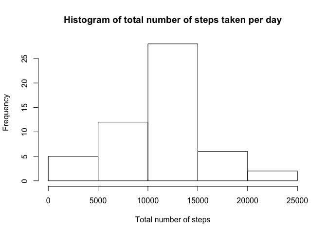
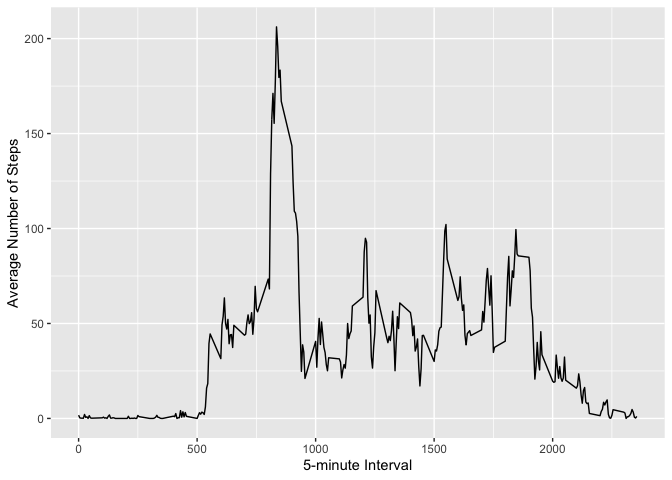
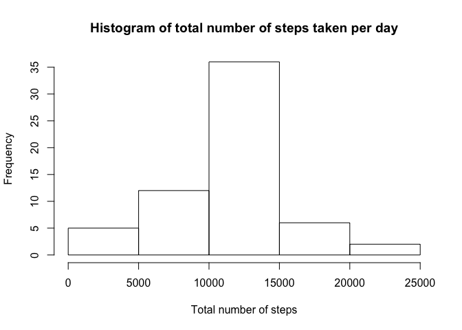
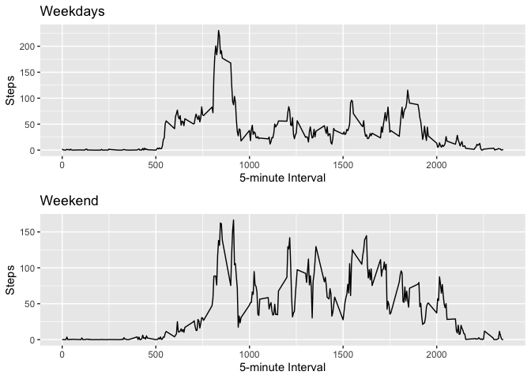

In the following the Peer Review Assignment for the Reproducible Research course is conducted.


First the necessary packages are loaded.


*Step 1: Loading and preprocessing the data*


We first load the necessary data into R and exclude NAs from the analysis:


```r
knitr::opts_chunk$set(echo = TRUE)
```

```r
Data <- read.csv("activity.csv")
Data_used <- na.omit(Data)
```


*Step 2: What is mean total number of steps taken per day?*


We now calculate the total number of steps taken per day:


```r
total_number_steps <- with(Data_used, tapply(steps, as.factor(Data_used$date), sum, na.rm = T))
```


We plot a Histogram of the total number of steps taken each day: 


```r
hist(total_number_steps, main = "Histogram of total number of steps taken per day", 
xlab = "Total number of steps")
```

<!-- -->


We calculate and report the mean and the median of the total number of steps which were taken each day by using the summary() function:


```r
summary(total_number_steps)
```

```
##    Min. 1st Qu.  Median    Mean 3rd Qu.    Max.    NA's 
##      41    8841   10765   10766   13294   21194       8
```


The output shows that the "mean number of steps" corresponds to 10766 steps while the "median of the total number of steps" equals 10765 steps.


*Step 3: What is the average daily activity pattern?*


We now make a time series plot of the 5-minute interval and the average number of steps taken, averaged across all days 


```r
by_avg_steps <- Data_used %>% group_by(interval) %>% summarise(avg_steps = mean(steps))
```

```
## `summarise()` ungrouping output (override with `.groups` argument)
```

```r
p <- ggplot(by_avg_steps, aes(x=interval, y=avg_steps)) + geom_line() +  
        
xlab("5-minute Interval") + ylab("Average Number of Steps")

p
```

<!-- -->


We now determine which 5-minute interval, on average across all the days in the dataset, contains the maximum number of steps 


```r
by_avg_steps %>% filter(avg_steps == max(avg_steps)) %>% select(interval)
```

```
## # A tibble: 1 x 1
##   interval
##      <int>
## 1      835
```

```r
max(by_avg_steps$avg_steps, na.rm = TRUE)
```

```
## [1] 206.1698
```


The 835th interval shows, on average across all the days in the dataset, the maximum number of steps. The maximum number of steps within this interval corresponds to 206.1698 steps. 


*Step 4: Imputing Missing Values*

We now calculate the number of missing values in the original dataset, i.e.the total number of rows which are NA


```r
sum(is.na(Data))
```

```
## [1] 2304
```

There are 2304 missing values, i.e. 2304 rows are NA. 

We now will fill all NAs with the average number of steps per interval taken that day and will create a new dataset which is equal to the original dataset but with the missing data filled in. We will loop through all the rows and find the one with NAs for steps. We will identify the average number of steps per interval for that day and substitue the NA value with that value. 


```r
avg_steps_per_interval <- aggregate(steps ~ interval, Data, mean)
 for (i in 1:nrow(Data)) {
 if(is.na(Data$steps[i])) {
        value <- avg_steps_per_interval$steps[which(avg_steps_per_interval$interval == 
                                                            Data$interval[i])]
         Data$steps[i] <- value 
     }
 }
```

Our new dataset now is called "Data" and we will go on working with that dataset. We plot a histogram now of the total number of steps taken each day. We then calculate the mean and median total number of steps taken per day and will have a look at how these values have changed due to imputing of missing values. 


```r
total_number_steps2 <- with(Data, tapply(steps, as.factor(Data$date), sum, na.rm = T))

hist(total_number_steps2, main = "Histogram of total number of steps taken per day", 
xlab = "Total number of steps")
```

<!-- -->

```r
summary(total_number_steps2)
```

```
##    Min. 1st Qu.  Median    Mean 3rd Qu.    Max. 
##      41    9819   10766   10766   12811   21194
```

The Mean total number of steps remains 10766, also the Median almost remains the same and changes to 10765 steps compared to 10766 steps above. The imputing of missing data has therefore not changed our results and states no problem for this analysis. 

*Step 5: Are there differences in activity patterns between weekdays and weekends?*

For this analysis we will go on using the cleaned Data from Step 4 (~Data). We first create a new factor variable in the dataset with two levels "weekday" and "weekend" indicating whether a given date is a weekday or weekend day. 


```r
Data$weekend <- chron::is.weekend(Data$date)
```

We now create a Panel Plot which contains a time series plot of the 5-minute interval and the average number of steps taken, averaged across all weekday days or weekend days.


```r
Data1 <- subset(Data, weekend == FALSE)

by_avg_steps1 <- Data1 %>% group_by(interval) %>% summarise(avg_steps1 = mean(steps))
```

```
## `summarise()` ungrouping output (override with `.groups` argument)
```

```r
Plot1 <- ggplot(by_avg_steps1, aes(x=interval, y=avg_steps1)) + ggtitle("Weekdays") + 
        geom_line() + xlab("5-minute Interval") + ylab("Steps")
 
 Data2 <- subset(Data, weekend == TRUE)
 
 by_avg_steps2 <- Data2 %>% group_by(interval) %>% summarise(avg_steps2 = mean(steps))
```

```
## `summarise()` ungrouping output (override with `.groups` argument)
```

```r
 Plot2 <- ggplot(by_avg_steps2, aes(x=interval, y=avg_steps2)) + ggtitle("Weekend") + 
         geom_line() + xlab("5-minute Interval") + ylab("Steps")
 
 figure <- ggarrange(Plot1, Plot2, ncol = 1, nrow = 2)
 figure
```

<!-- -->
